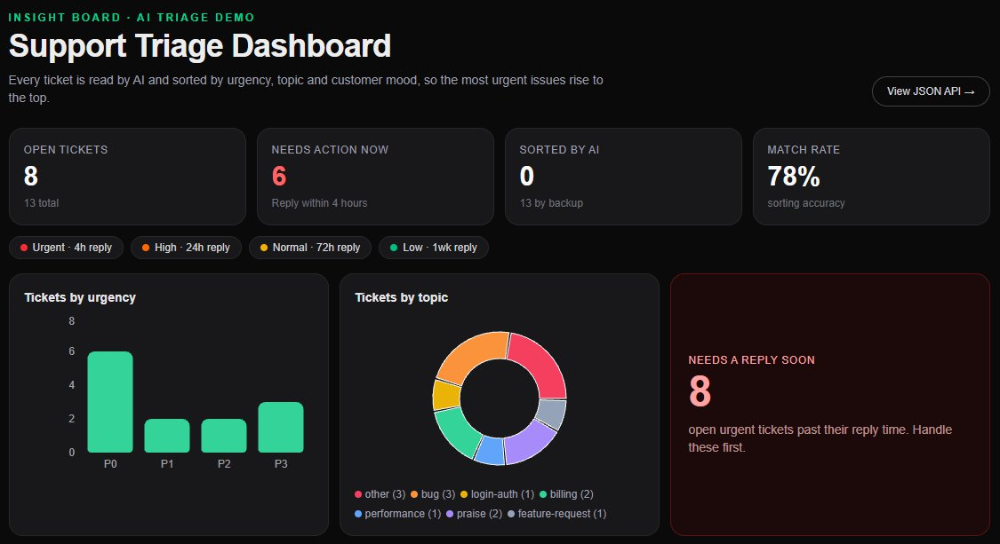
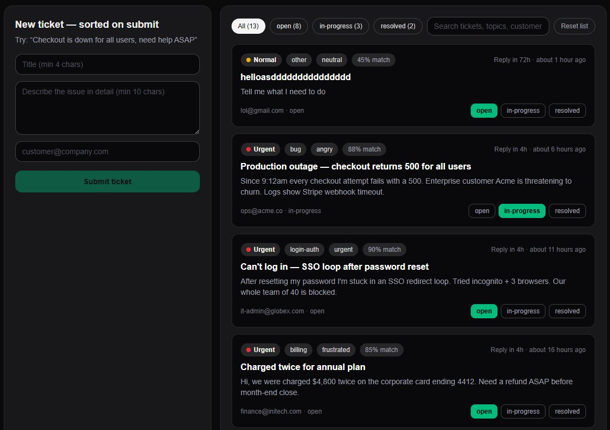

# Insight Board — AI Support Triage Dashboard

> **Proof of concept:** an AI help-desk command center that auto-classifies every incoming
> support ticket by **priority (P0-P3), sentiment, topic and SLA risk** — then shows the
> whole queue on a realtime-style dashboard backed by serverless Postgres.

**Live demo:** https://insight-board-rho.vercel.app ·
**Stack:** Next.js 16 · TypeScript · Tailwind 4 · Zustand · Recharts · Neon Postgres ·
HuggingFace Inference · Playwright

---

*The full board: KPI stats, urgency and topic charts, reply-risk panel, submit form and ticket queue.*

---

## What this is (and what it is not)

**This is a proof of concept** built in a day to demonstrate one idea end-to-end:

> *Can a small team triage support tickets automatically — with transformer-grade quality,
> a graceful offline fallback, and a dashboard a non-technical manager can read?*

It is **not** a Zendesk replacement: no auth, no multi-tenancy, no email ingest,
no agent assignment. Every one of those is a deliberate cut so the core loop —
**submit, classify, persist, visualise** — can be read, run and deployed in minutes.

What the POC **does** prove:

1. **AI classification with a safety net** — live HuggingFace transformers when a token is
   configured, deterministic rules engine otherwise. The demo never breaks.
2. **Serverless persistence that degrades gracefully** — Neon Postgres when DATABASE_URL
   is set, rich local seed data when it is not. Same API shape either way.
3. **A dashboard that answers three questions** — how bad is it (P0 count plus SLA risk),
   what is it (priority/topic charts), what is next (filterable queue with status workflow).
4. **Production hygiene on a POC budget** — zod validation, typed API contracts,
   Playwright e2e, lint plus tsc clean, secrets server-side only, $0 to run.

---

## Features

- **Dual-mode AI triage** — every ticket gets priority, sentiment, topic,
  confidence, SLA hours, human-readable reasons from either the transformer pipeline
  or the rules engine. The source field (ai vs rules) is shown on every badge.
- **KPI stats bar** — open tickets, P0 critical count, AI-vs-rules split, average
  confidence, plus an inline SLA legend (P0 4h, P1 24h, P2 72h, P3 1 week).
- **Triage charts (Recharts)** — tickets-by-priority bar, tickets-by-topic donut, and
  an SLA-risk panel counting unresolved P0/P1 tickets against their windows.
- **Submit plus auto-triage form** — POST /api/triage classifies on submit, persists to
  Neon when configured, and the new ticket appears at the top of the feed instantly.
- **Filterable queue** — status tabs (all, open, in-progress, resolved), free-text
  search across title, body, customer and topic, one-click status transitions.
- **JSON API** — GET /api/tickets returns tickets plus source (neon or seed),
  so consumers always know whether they are reading live data.

*New-ticket form and queue: each ticket shows urgency, topic, mood, match rate and reply time.*

---

## AI models and data

### Transformer pipeline (src/lib/triage.ts)

Two hosted HuggingFace models run in parallel, server-side only:

- Emotion to sentiment: SamLowe/roberta-base-go_emotions (RoBERTa-base, 28-label
  GoEmotions text classification). Top emotion maps to sentiment plus priority:
  anger/annoyance/disgust becomes angry (P0 when score above 0.7, else P1);
  fear/nervousness becomes urgent (P0); sadness/disappointment becomes
  frustrated (P1); joy/gratitude/love becomes positive (P3); else neutral (P2).
- Topic: facebook/bart-large-mnli (BART-large MNLI) as a zero-shot classifier over
  8 candidate labels: billing, bug, feature-request, login-auth, performance,
  question, praise, other. Top label wins.

Both calls hit the HuggingFace Inference API on the first 1000 characters of
title plus body. Final confidence is a weighted blend: 0.6 times emotion score
plus 0.4 times topic score. Any failure - no token, model cold-start (503), rate
limit (429), network error - falls straight through to the rules engine, so one
slow model can never break ticket submission.

### Rules engine (src/lib/triage-rules.ts)

A deterministic, dependency-free fallback: 7 weighted regex families (billing,
login-auth, bug/crash, performance, feature-request, praise, question) plus an
urgency booster (urgent, asap, production, all users, data loss, security
escalates to P0) and an anger booster (strong negative language forces angry
sentiment and raises priority). Short messages under 60 chars get a confidence
penalty. Weights and SLA windows live next to the patterns, so the whole policy
is auditable in one small file.

### Seed dataset (src/lib/seed.ts)

12 hand-written tickets modelled on realistic SaaS support traffic - a checkout
500 outage, an SSO loop locking out 40 people, a double charge, a Safari WASM
blank page, a PII-in-logs security report, plus feature requests and praise to
exercise the low-priority path. Each seed is pre-triaged through the rules
engine at import time, giving the offline demo a believable P0-P3 spread with
staggered timestamps so the reply-risk panel has something to chew on.

### The JSON API (no screenshot needed - try it live)

`GET /api/tickets` returns the queue as JSON: an array of tickets (id, title,
body, customer, status, urgency, mood, topic, match rate, reply window,
created-at) plus a `source` field that is `neon` when reading live database
rows or `seed` when serving the built-in demo set. `POST /api/triage` accepts
`{ title, body, customer }`, validates it strictly (title 4-200 chars, body
10-5000, customer an email or 2-120 chars - invalid input gets a `400`, never
a `500`), classifies it, saves it when the database is configured, and returns
`{ ticket, source }`. Both endpoints are typed end-to-end with the frontend
store, so the dashboard and any API consumer always agree on the shape.

## How it works

Submit, classify, persist, visualise. The new-ticket form posts title/body/
customer to POST /api/triage (zod-validated). triageTicket() tries the parallel
HuggingFace inference when HF_TOKEN is set, otherwise the rules engine; any
throw falls back to rules so the demo never breaks. The result carries
priority, sentiment, topic, confidence, SLA hours, reasons and source (ai or
rules). When DATABASE_URL is set the ticket is INSERTed into Neon Postgres and
returned with source neon; otherwise an ephemeral id is returned with source
seed. GET /api/tickets reads Neon rows (ORDER BY created_at DESC, 200) or the
local seeds. A Zustand store (localStorage-persisted) feeds the StatsBar,
Recharts charts and filterable TicketList.

Key files: src/lib/triage.ts (HF pipeline plus fallback), triage-rules.ts
(offline classifier), seed.ts (12-ticket demo set), db.ts (lazy Neon client,
null when unconfigured), store.ts (board state), app/api/triage/route.ts
(validate, classify, insert), app/api/tickets/route.ts (read Neon or seeds),
neon/schema.sql (tickets table, pgcrypto, 3 indexes), scripts/apply-schema.mjs
plus verify-db.mjs plus wipe-tickets.mjs plus cleanup-verify.mjs (schema and
hygiene), e2e/board.spec.ts (Playwright: submit shows badge; status filter).

A typical round trip, described: submit *"Checkout is down for all users, need
help ASAP"* and the bug pattern plus urgency booster fire - Urgent, angry,
88 percent match, 4-hour reply, saved to the database. Submit *"Love the
product! Two asks: Salesforce sync and dark mode"* and the opposite path
fires - feature-request, positive, Low, 168-hour reply. Same form, same speed,
correctly opposite urgency. That contrast is the whole pitch.

---

## Use cases

1. SaaS support triage - route billing plus angry to a human immediately, file
   feature-request plus positive to the backlog, let the SLA-risk panel shout
   about P0s before customers churn. The 4/24/72/168h windows mirror real tiers.
2. E-commerce incident flagging - during a sale spike, checkout-500 and
   charged-twice patterns surface as P0 within seconds instead of waiting for
   someone to read the queue.
3. Open-source issue labelling - the zero-shot topic set maps onto GitHub label
   taxonomies; swap the intake for a webhook and maintainers get pre-labelled
   issues.
4. Support-lead reporting - stats plus charts are a stand-up-ready summary with
   no spreadsheet required.
5. AI-fallback pattern reference - the try-transformers-catch-rules structure is
   a reusable template for demos that must survive dead tokens and cold models.

## What this POC showcases

Full-stack ownership (Next.js UI plus API plus Postgres plus serverless deploy,
typed end-to-end). Pragmatic AI integration (right-sized hosted models over an
LLM for classification, parallel inference, fallback designed first). Data-layer
judgement (serverless HTTP Postgres, single server-side DATABASE_URL, idempotent
schema scripts, seed fallback for zero-setup clones). Operational maturity
(validation at the boundary, honest source labelling, e2e tests, secrets never
in client or repo). Cost awareness (Vercel Hobby plus Neon free plus HF free
inference; offline mode is $0 and the default).

## Run it

Clone, install, dev - works immediately with no keys (seed mode):

  git clone https://github.com/deesingsong/AI-Support-Triage-Dashboard.git
  cd AI-Support-Triage-Dashboard/insight-board
  npm install
  npm run dev

Optional live AI plus persistence: copy .env.example to .env.local, set
DATABASE_URL (pooled Neon string) and HF_TOKEN, run
node scripts/apply-schema.mjs, restart dev. Verify: GET /api/tickets returns
source neon; submit the form and the badge shows via ai (or via rules when HF
is unreachable - both are correct).

## Tests and deploy

  npm run lint
  npx tsc --noEmit
  npm run build
  npx playwright install chromium
  npx playwright test
  vercel --prod

Deployed at https://insight-board-rho.vercel.app.

